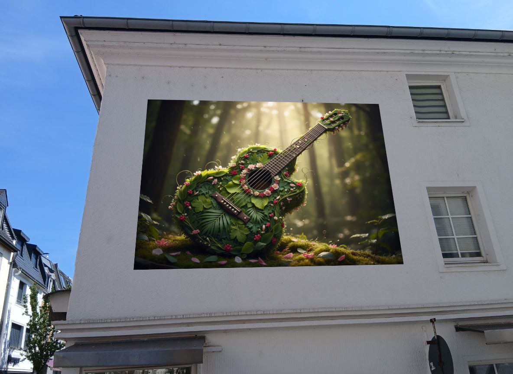
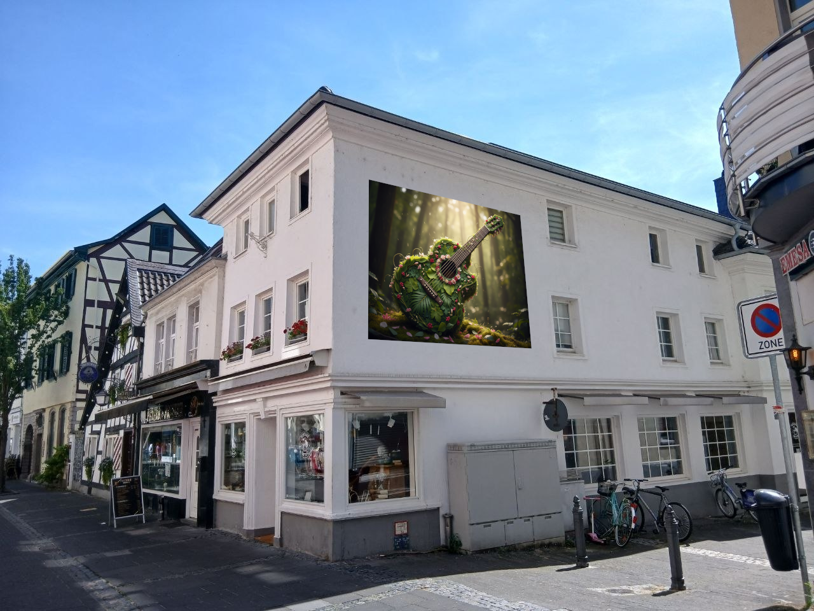
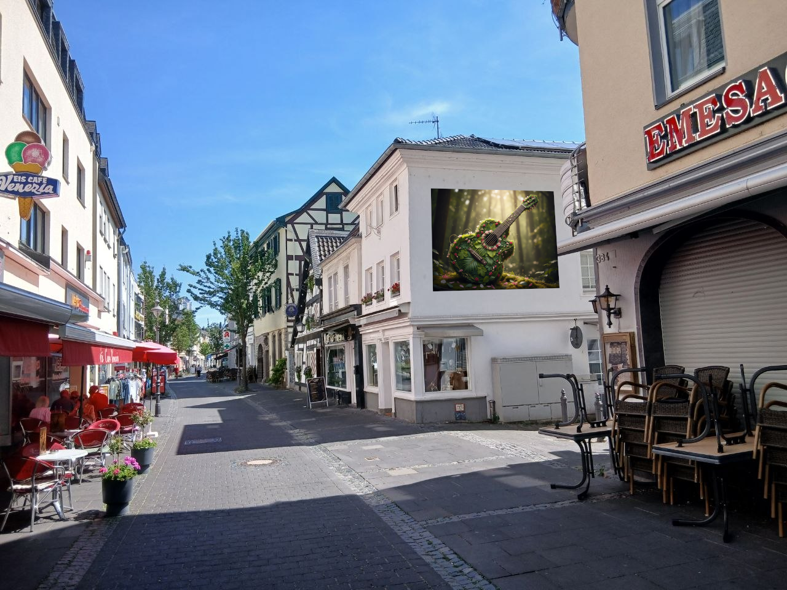
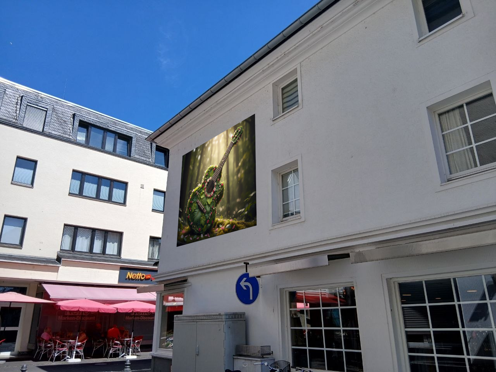
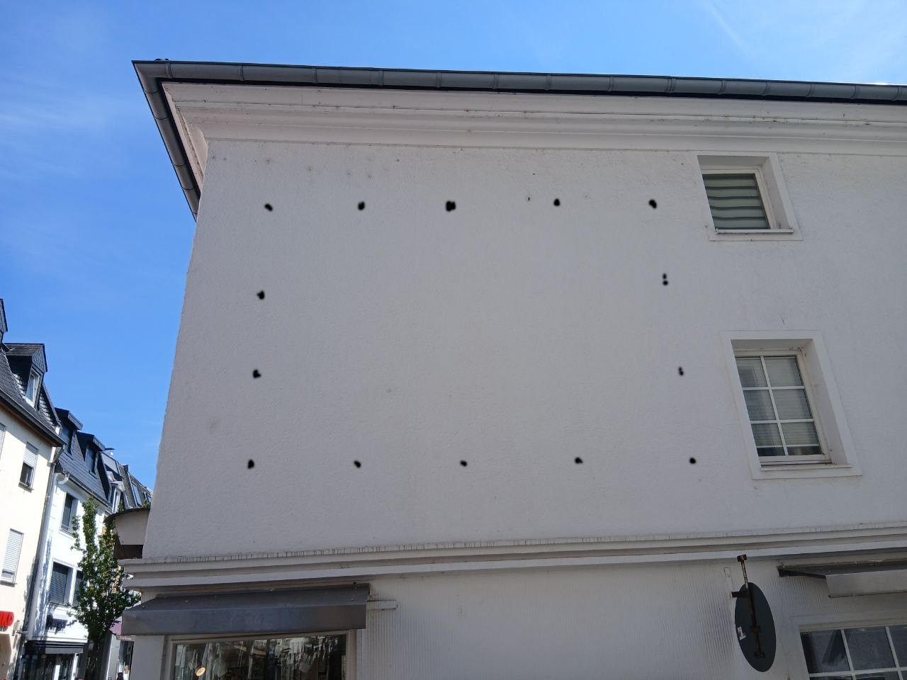

# Kunst im öffentlichen Raum

Wir haben ein Haus, in einer Fußgängerzone, mit einer großen weißen Wand,
die man beim Bummeln und Eis-Essen sehr prominent sehen kann.
Auf diese Wand sollte ein Hingucker. Aber warum nur einer?
Warum nicht regelmäßig neue Kunst? Alle 4 Wochen? Das wären ja 13
Bilder in einem Jahr an einer Wand!

# Idee:
Die freie Wand ist ca 5x4m groß. Mit je 50cm Abstand an allen Seiten bleibt
eine Nettofläche von 4x3m. Das ist ein Format, für das man bedruckte Planen
bestellen kann. Wenn man an die Wand ein Befestigungsmethode macht (Schienen,
Haken, etc), kann man alle 4 Wochen eine Plane abnehmen und durch eine neue
ersetzen.

# Technische Umsetzung (Vorschlag)

## Fest montiert
14 Gewindestangen in der Wand: 
* je 5 oben und unten
* je 2 links und rechts

Die Montagepunkte ziehen ein Rechteck im Format 4x3m, mit einem Abstand von jeweils 1m.

## Wechselbar

Bedruckte Planen im passenden Format mit eingelassenen Ösen an den Positionen der Haken. 
Die Plane wird an den Ösen über die Gewindestangen gehängt und mit Unterlegscheiben und
Muttern gesichert.

# Gestaltungssatzung vs Kunstfreiheit

Man darf doch nicht einfach irgendwas mit irgendeiner Wand machen? 
Doch, wenn es Kunst ist.
