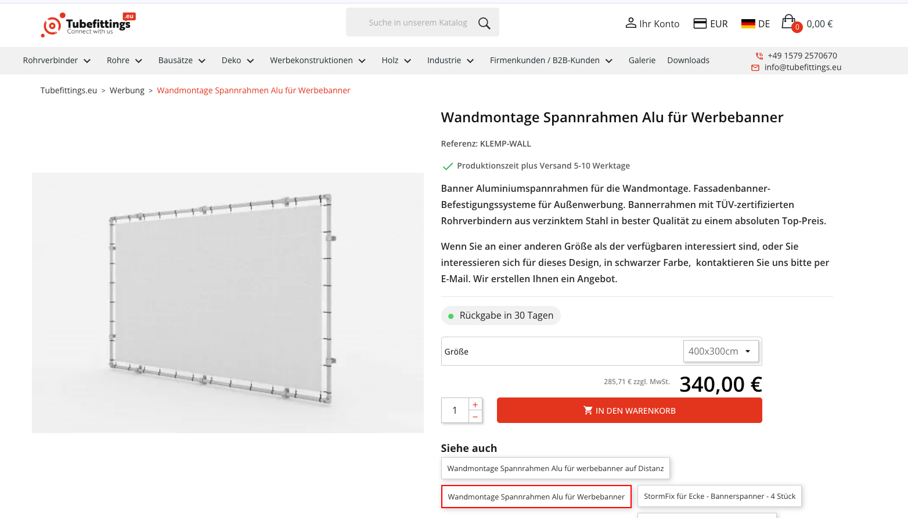
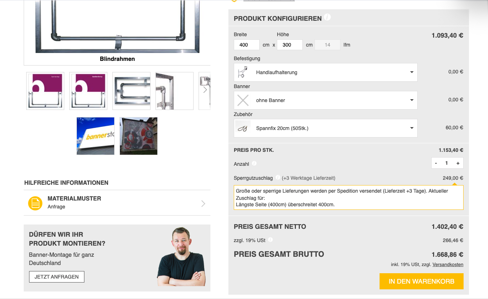

# Kunst im öffentlichen Raum

Wir haben ein Haus, in einer Fußgängerzone, mit einer großen weißen Wand,
die man beim Bummeln und Eis-Essen sehr prominent sehen kann.
Auf diese Wand sollte ein Hingucker. Aber warum nur einer?
Warum nicht regelmäßig neue Kunst? Alle 4 Wochen? Das wären ja 13
Bilder in einem Jahr an einer Wand!

# Idee:
Die freie Wand ist ca 5x4m groß. Mit je 50cm Abstand an allen Seiten bleibt
eine Nettofläche von 4x3m. Das ist ein Format, für das man bedruckte Planen
bestellen kann. Wenn man an die Wand ein Befestigungsmethode macht (Schienen,
Haken, etc), kann man alle 4 Wochen eine Plane abnehmen und durch eine neue
ersetzen.

# Auswahl der Kunstwerke

## Das Kuratorium
Hier stellen wir uns ein Kuratorium von 7 Personen vor, in dem die Sitze
etwa wie folgt vergeben werden:
* 2 Sitze für die Hausbesitzer (because.)
* 2-3 Sitze Königswinterer Vereine
  * Nicht Davor Und Nicht Dahinter eV
  * Gemeinschaft Königswinterer Künstler
  * Gewerbeverein Königswinter-Altstadt e.V
* 2-3 Sitze lokale Künstler
  * Hotspot KW
  * Kunstlehrer CJD
  * Kunstforum Palastweiher
* 1-2 Spnsoren & Mäzene
  * ???

# (Halb-)Jahresplanung

* Das Kuratorium trifft sich alle 6 Monate und plant die nächsten 24 Wochen bzw 6 Werke
* Jeder Teilnehmer bringt als Vorschlag 1-2 Künstler mit
* Die Vorschläge werden in eine Reihenfolge gebracht,
* die ersten 6-8 Künstler werden angefragt. 
  * wenn zuviele zusagen wandern sie ins nächste Halbjahr

# Link und QR Code
Alle gehängten Plakate bekommen ein Overlay mit der Webseite und einem darauf verweisenden QR Code

# Technische Umsetzung (Vorschlag)

## Vorschlag #1: Spannrahmen

### Fest montiert
Röhrenrahmen mit 430x330cm an der Wand befestigen

### Wechselbar

Beliebige Planen mit Maß 400x300cm und Ösen. Die Plane wird mit Gummispannern
am Gestänge befestigt.

## Vorschlag #2: Blindrahmen (AKA Spannbettlaken)

### Fest montiert
Eine Platte im Maß 400x300 [wird an die Wand montiert](https://www.bannerstop.com/produkte/rahmen-systeme/fassaden-rahmen/blindrahmen.html)

### Wechselbar
Spezielle Plannen mit 420x320 und Gummiband werden über die Platte gehängt, und der Überhang hinter der Platte verspannt

## Vorschlag #3: Direkt an die Wand

### Fest montiert
14 Gewindestangen in der Wand: 
* je 5 oben und unten
* je 2 links und rechts

Die Montagepunkte ziehen ein Rechteck im Format 4x3m, mit einem Abstand von jeweils 1m.

### Wechselbar

Bedruckte Planen im passenden Format mit eingelassenen Ösen an den Positionen der Haken. 
Die Plane wird an den Ösen über die Gewindestangen gehängt und mit Unterlegscheiben und
Muttern gesichert.

# Gestaltungssatzung vs Kunstfreiheit

Man darf doch nicht einfach irgendwas mit irgendeiner Wand machen? 
Doch, wenn es Kunst ist.
